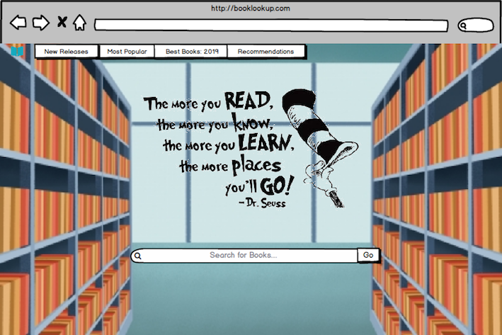
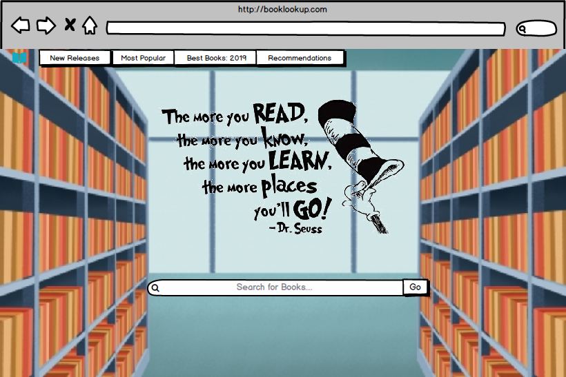

# BookLookUp 

This project is a search engine which allows users to search for books or authors of their choice.
The search results return a picture of the book, the books title, the books author, an average rating 
(out of 5) for the book and a description of the book where available. The project makes use of the Google Books API to 
achieve this result.

## UX

This site is designed for people who are interested in reading books and would like to find out some information
on the books they are planning to read before reading them.
As a user, I want to get some information on a particular book. This is done by typing in the name of the book and the results
for the book will show the title, author, average rating, description and picture of the book.
As a user, I want to find out some book titles of a particular author, which I would achieve by typing the authors name 
into the searchbar. The results will contain multiple books which that author has written.
As a user, I want to find what the average rating of a book is. This is achieved by typing in the name of the book and the 
results will show an average rating for the book.
As a user, I want to read some book descriptions for various books. This is done by typing a search query into the searchbar
and the results will have descriptions for the results.
The site is also designed towards people who may be looking for recommendation for books to read which I have included in 
the navigation bar of the page. All the navigation headings lead to corresponding Amazon book pages containing book recommendations.
As a user, I want to find some newly released books which I can achieve by clicking on the New Releases header in the navigation
bar which will take me to Amazons list of newly released books.
As a user, I want to find some books which are best sellers. I can achieve this by clicking on the Best Sellers header in 
the navigation bar which will take me to a list of Amazons best selling books.
As a user, I want to find a good book released this month which I can achieve by clicking on the Book of the Month header
in the navigation bar which will take me to a page containing Amazons book of the month.

### Wireframes

#### Before searching for anything

#### After searching for something

 

I chose the background image as a cartoon-like library with an open space in between two bookshelves. I chose this as I
thought the open space in between the two bookshelves would look good bordering the search results output and thought the 
colors of the image really suited the purpose of the website.
When the search results are returned these search results are output onto the open space between the two bookshelves which
frames the search results. 
Before doing the search, there is a quote from Dr. Seuss which highlights an advantage of reading.
Once the search function is in progress, this quote disappears from the screen and the search bar area jumps to the top of 
the screen. 
I chose to have 10 book results per page with each book area containing the title, author, description, picture and rating
for the book. When the user selects either the previous or next page the screen scrolls to the top of the list again
allowing ease of use.
I decided to put pagination buttons on both the top and bottom of the search results area due to if sanyone seen a book they
liked but then went to the next page, if the pagination buttons were only at the bottom they would have to
scroll down the entire page to select the previous page button.
The pagination buttons change font and background color with a smooth transition when they are hovered over and the mouse
cursor also changes to a pointer.

## Features
### Existing Features
* Search Bar: The search bar allows the user to type in a book or author name. Once this is entered they can either press
enter on the keyboard or click the magnifying glass to submit their search.
* Navigation Bar
  * Branding: The navigation bar brand is a font awesome icon of a book which if clicked the user will be sent back to the
  original search home page no matter how far into their results list they are.
  * Headings: The navigaton bar headings all link to Amazon pages. If the user want some information on newly released books
  the New Releases option in the Navbar will open up Amazons page for newly released books in a new tab. This is the same 
  result as the rest of the headings but the Amazon page that opens for the user is relative to it's text ie. best sellers,
  book of the month and Kindle best sellers.
* Book Results: After   submitting a search query in the search bar, the user is presented with a list of books matching their 
search query. Each book result returns the books name, authors, picture, average rating and descriptionwhere avaiable. This 
makes use of the Google Books API and I came across some books which dont have a rating or description so for these I have
coded a default message for the user so that these areas dont return undefined.
### Features Left To Implement
* Add Rating : An add rating feature could be implemented in the future which would allow the user to add their own rating
of the book by clicking a button and selecting an option out of 5 which they would rate the book.
* Add Description: For the Google Books book results that dont have a description yet a Add Description option could be 
included in the default return which would take the user to a page at which they can add their own description for the book.
* Buy Now: A 'buy now' option could be implemented in the future which would be a button which has a value of buy now in it.
By clicking this button the user would be taken to a website which they can purchase the book from.
## Technologies Used
 * HTML: This project uses HTML to provide the structure of the pages. 
 * CSS: This project uses CSS to provide styling to the HTML structure.
 * Bootstrap: I have used bootstrap in this project to help provide further structure to the page and aid the responsivness
 of the site.
 * JavaScript: I have used Javascript to write functions for the site. These consist of getting the JSON response from the 
 Google Books API, allowing the user to search for a particular query, allow the screen to show a loading gif while the user
 is searching, outputting this response data in a particular way, allowing the pagination buttons to load pages in the 
 results and scrolling to the top of of the book list for every newly loaded page of results in a timely manner.
* JQuery: this project utilses jQuery by hiding the image of the quotation once the user has submitted a search query, moving
the search bar to the top of the screen when a search query is submitted, showing the book results output section when a search
query is submitted and allowing the enter keyboard key to submit a search query.

