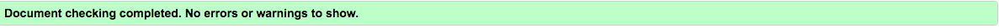
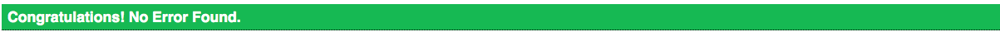

# BookLookUp 
This project is a search engine which allows users to search for books or authors of their choice. The search results return
a picture of the book, the books title, the books author, an average rating (out of 5) for the book and a description of 
the book where available. The project makes use of the Google Books API to achieve this result.

## Website URL 
The website can be viewed by using this link: https://djjtyn.github.io/bookLookUp/

## UX
This site is designed for people who are interested in reading books and would like to find out some information
for books. 
I chose to do a different design for the book results area than I initially designed in the mockup.I have arranged the retrieved
book details in a particular way as I believe it is aesthetically pleasing. I chose to have the books' images on the left of 
each  retrieval section, the title, author and rating of the book in a list parallel to the picture and the books' 
descriptions underneath these. 
As a user, I want to get some information for a particular book. This is done by typing the name of the book into the searchbar
and submitting the query. The results will show the title, author, average rating, description and picture of the book. 
As a user, I want to find out some book titles from a particular author. I would achieve this by typing the authors name 
into the searchbar and submitting the query. The results will contain multiple books which that author has written. 
As a user, I want to find what the average rating of a book is. This is achieved by typing the name of the book into the
searchbar and submitting the query. The results will show an average rating for the book. 
As a user, I want to read a description for a particular book. This is done by typing the book name into the searchbar and 
submitting the query. The results will show a description for the book. 
This site is also designed towards people who may be looking for a recommendation for a books to read. I have included this
aspect by using the navigation bar. 
As a user, I want to find some newly released books. I can achieve by clicking on the New Releases heading in the navigation
bar which will take me to Amazons list of newly released books. 
As a user, I want to find some books which are best sellers. I can achieve this by clicking on the Best Sellers heading in 
the navigation bar which will take me to a list of Amazons best selling books. 
As a user, I want to find a good book released this month which I can achieve by clicking on the Book of the Month header
in the navigation bar. This will take me to a page containing Amazons book of the month.
### Wireframes
#### Before submitting a search query

#### After submitting a search query

 
The background of the site is an image of a cartoon library with an open space in between two bookshelves. I chose this as 
I thought the open space in between the two bookshelves would look good as a frame for the search results output. I thought
the colors' of the background image suited the style of site I was trying to create as I didn't want to create a site that 
would only attract habitual readers. 
Before submitting a search there is an image of a Dr. Seuss quote which highlights the advantage of reading. I added this
to the site in an effort to entice non-readers to use the site to find a book they may consider reading. 
While the user is typing a value into the search bar a loader gif appears. This gif is of a book with it's pages turning. I
chose this gif as I believe it suits the sites purpose. 
After a search query is submitted, the quote image disappears from the screen and the search bar area jumps to the top of 
the screen. I chose to do this to create more space for the book results which are listed below the search bar.  
I chose to have 10 book results per page as I was conscious that having a higiher number than 10 books per page could clutter
the page and not look as good. 
Each book details area contains the title, author, review, picture and description of the book. I chose to have the picture
in the left of the books area with the books title,author and rating beside it and the description underneath these. I thought
that would look like a nice organised way to present the book details. 
I decided to put next and previous pagination buttons on both the top and bottom of the search results area. I decided to do 
this because if anybody saw a book they liked on a previous page and wanted to go back a page to see details for it again
rather than scrolling all the way to the bottom of the page to find the previous button, they could select it from the top
of the page. 
The pagination buttons change font and background color with a smooth transition when they are hovered over and the mouse
cursor also changes to a pointer. I chose to do this because the user can clearly see when they are hovered over a button. 
When the user selects either the previous or next page the screen scrolls to the top of the list again allowing ease of use.
## Features
### Existing Features
* Search Bar: The search bar allows the user to type in a book or author name. Once this is entered they can either press
enter on the keyboard or click the search icon to submit their search.
* Navigation Bar
  * Branding: The icon on the left of the navigation bar is a font awesome icon of a book. If this icon is clicked on the 
user will be taken back to the initial search home page no matter how far into their results list they are.  
The icon color changes to red when the mouse hovers onto it. I chose to do this as I believe it makes it look clearer when
the mouse is in the correct position to click the icon and then send the user back to the home page.
  * Headings: The navigaton bar headings all link to Amazon pages. If the user wants some information on newly released books
  the New Releases option in the Navbar will open up Amazons page for newly released books in a new tab. This is the same 
  result as the rest of the headings with the Amazon page that opens for the user is relative to it's text ie. best sellers,
  book of the month and Kindle best sellers.
* Book Results: After submitting a search query, the user is presented with a list of books matching their search query. Each
book result returns the books name, author, picture, average rating and description where avaiable. This makes use of the 
Google Books API. I encountered some book searches which output undefined ratings and descriptions. For these. I have coded a
default message for the user so that these areas dont return undefined.
### Features Left To Implement
* Add Rating : An add rating feature could be implemented in the future which would allow the user to add their own rating
for a book by clicking a button and selecting an option out of 5 which they would rate the book.
* Add Description: For the Google Books book results that dont have a description yet an Add Description option could be 
included in the default return which would take the user to a page at which they can add their own description for the book.
* Buy Now: A 'buy now' option could be implemented in the future which would be a button which has a value of "Buy Now" for it.
By clicking this button the user would be taken to a website which they can purchase the book from.
## Technologies Used
 * HTML: This project uses HTML to provide the structure of the page. 
 * CSS: This project uses CSS to provide styling for the HTML.
 * Bootstrap: I have used bootstrap in this project to help provide further structure to the page and aid the responsive 
 design
 of the site.
 * Bootswatch: I used a Bootswatch template called "Sketchy" for the navigation bar.
 * JavaScript: I have used Javascript to write functions for the site. These consist of getting the JSON response from the 
 Google Books API, allowing the user to search with a particular query, allowing the screen to show a loading gif while the 
 user is searching, outputting this response data in a particular way, allowing the pagination buttons to load pages and 
 scrolling to the top of the book list for every newly loaded page of results in a timely manner. 
 Javascript is also used to simplify DOM manipulation.
* JQuery: this project utilses jQuery by hiding the image of the quotation once the user has submitted a search query, moving
the search bar to the top of the screen when a search query is submitted, showing the book results output section when a 
search query is submitted and allowing the enter keyboard key to submit a search query. 
JQuery is also used to simplify DOM manipulation.
## Testing
HTML Validation was done using the validator found at "https://validator.w3.org/". This validation test returned no errors.
 
CSS Validation was done using the validator found at "https://jigsaw.w3.org/css-validator/". This validation test returned
no errors.
 
* Search Bar
I had to check whether the text that a user typed into the searchbar was being stored in a variable I had created to contain 
it. I tested this by creating the variable, adding text into the search field and using console log to ensure the value that was entered was
being logged to the console. 
I also had to check that the enter button was being used to submit the value the user entered into the search bar. I tested this 
by typing text into the searchbar and pressing the enter key to see if the function I had created to show the book results 
was called. 
I had to make sure the user would be prompted when a search query was submitted without a value in the searchbar. I did
this by coding an alert to appear on screen when a search query without a value was submitted which I tested by
submitting a search query without any value and checking to see if the alert box appeared.

* Loading Gif: 
I first included the loading gif in the function which contained the getJson url command but noticed that this wasnt
appearing for any more searches after the first. I then created a new function specifically for the loading gif and then used
it as the oninput value for the input element. I tested this by typing text into the searchbar on different pages and 
checking that the gif appeared

* Pagination:
  * Page Selection: The Google Books API response doesnt return a pre and next array response so I had to create these myself
to have each book listing only show 10 results per page. I did this by creating max results and start index variables and 
making use of these. I included both these variables in the getJson url. I tested this by using console log to check that 
the json response was returning values with the variables contained in its url. I then created a load next page function 
that called the function containing the getJson method within this function and assigned the start index variable to be the 
maxindex variable plus one. I created a next button and assigned the load next page function to it's onclick attribute so 
that I was able to test the function by clicking the button and checking to see if the next page loaded. 
For the load previous page function I set the start index to equal the start index minus the max results minus one. I then 
used console log to check that the start index variable had a value. I then ran the function containing the getJson method 
within this function. I created a previous button and assigned the load previous page function to it's onclick attribute so
that I was able to test it by clicking the button and checking to see if the next page loaded.
  *  Page Scrolling: To ensure that anytime a user clicked the previous or next buttons that the new list started at the 
top allowing the user to scroll downward through the list again, I had to create a function called scrollToTop. I then created
a function which set 2 timeouts. This function contains the scrollToTop function and the function to load the next
page and I had to set a timed timeout to make sure that the pages were only scrolling to the top once the next page had already
loaded. I tested this by trying different time duration for each child function and clicking the next button to ensure that 
the page was scrolling to the top of the list when the next page had loaded. 
I also did this for the previous pages and tested using the same method.
* Json Response: I had to check that I was receiving a response from the Google Books API which I did by logging the response
to the console. I then noticed that some of the results were returning undefined so had to create a default value for these
response returns. I tested this by outputting the response to the site using template literals within a function after coding
a bit of code that gave the undefined response returns a custom value and searching for books that I knew had undefined values
to check they were returning the default values I had assigned to them if the initial value was undefined.
## Bugs
I encountered a bug on the site that I was able to fix. This occured when a user searched for a book and clicked the previous
button on the first page of results. This led to a bug in the code which. I had an cutomised error message to show for when
this occured but I resolved this by hiding the previous button on the first page of book results.
## Deployment
I have deployed this to Github and have been regularly adding and comitting changes to the projects local depository. I have
used Gitpod entirely for coding and have been pushing any additions I make to the local depository onto Github as a precaution
in case the changes didn't save in the project workspace so there are no differences between the deployed version and the 
development version. 
This code can be ran locally using https://djjtyn.github.io/bookLookUp/ which opens the site in a browser window. 
To clone or download the code used to create the site, you can find it on github here:https://github.com/djjtyn/bookLookUp
,choose the option to either download or clone and follow the instructions onscreen.
## Credits
### Media
For the background image, I chose an image from https://pngtree.com/. The full image URL can be found here: https://pngtree.com/freebackground/simple-book-tube-bookshelf-background-material_918534.html 
I chose to resize this image using an online photo enlarger tool found here: https://www.photoenlarger.com/ 
For the loader gif, I chose a gif from https://giphy.com/. The full gif url can be found here:https://giphy.com/stickers/book-npuIsCFsoLGiQ 
For the favicon image, I chose an image from https://www.freefavicon.com/. The full url can be found here: https://www.freefavicon.com/freefavicons/icons/iconinfo/book-icon-152-191918.html 
The image for each book is taken directly from Google books using its API. 
I imported a font called Lato from Google fonts.
### Content
Each books details are returned from the Google Books API. Apart from that all of the sites content is my own.
### Acknowledgements
* Google Books API: WIthout use of the Google Books API, I would not have been able to do this project. I read a lot of their
documentation on how to use the API when neccessary. 
* Amazon: All of the headings in the sites navigations bar link to Amazon web pages.
* Stack Overflow: I used a lot of information on Stack Overflow to allow me to enhance the site's functionality. 
* https://codingshiksha.com/: Due to the Google Books API not returning prev and next values in its response I had to 
understand how to allow each book result list to only show 10 results per page and create previous and next buttons to show 
the next or previous ten results. I found an article here: https://codingshiksha.com/google-books-api-pagination-example-in-javascript
which helped me to better understand how to paginate the API's response.

